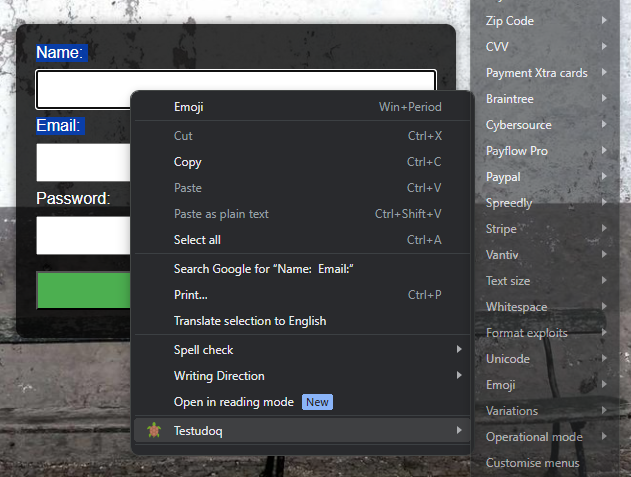

# Testudoq - Exploratory Testing Assistant for Chrome and Firefox



Testudoq serves as a powerful companion for exploratory testing sessions, offering seamless integration with popular browsers like Chrome and Firefox. Its primary function is to enrich the testing experience by granting testers instant access to critical boundaries and edge cases directly from the context menu (right-click) for editable elements within the application under test.

By seamlessly integrating Testudoq into their exploratory testing sessions, testers can leverage its intuitive interface to swiftly identify and manipulate problematic values. This immediate access to boundary conditions empowers testers to thoroughly explore the software's behavior, uncovering potential defects and vulnerabilities more efficiently.

Aligned with session-based testing principles advocated by Rapid Software Testing (RST), Testudoq facilitates rapid and adaptive test design and execution. Testers can dynamically adjust their testing approach based on real-time observations, leveraging Testudoq's capabilities to delve deeper into the application's functionality and resilience under various conditions.

Furthermore, Testudoq's compatibility with session-based testing methodologies ensures that testers can easily incorporate it into their testing sessions, enhancing collaboration and maximizing the effectiveness of their testing efforts. By streamlining the exploration process and providing instant access to critical test scenarios, Testudoq empowers testers to deliver high-quality software within tight timelines and dynamic project environments.

## Features

- Convenient access to common boundaries and edge cases for exploratory testing
- Easy extension with custom config files
- Works on input fields, text areas, and content editable DIVs
- Supports multi-frame pages from the same domain
- Compatible with Chrome, Edge, and Firefox
- Minimal overhead per page (<1k), no third-party library dependencies, and completely passive without interfering with web app execution

## Usage

The extension can be installed from the [Chrome Web Store](url) or [Mozilla Add-ons](url).

After installation, simply right-click on any editable item on the page to reveal the Testudoq submenu. Click on an item, and it will be inserted into the editable field.

## More Information

- [What's New in the Latest Version?](https://testudo.co.nz/futterman/v0.9.html)
- [How to Install and Use Testudoq](https://github.com/testudoq-org/testudoq3/blob/main/README.md)
- [Contribute or Support Development](https://github.com/testudoq-org/testudoq3/blob/main/CONTRIBUTING.md)
- [Customise Menus in Testudoq](https://testudo.co.nz/futterman/futterman/testudoq-help.html)
- [Developer Guide](CONTRIBUTING.md)
- [Resources About Edge Cases in Testudoq Menus](https://testudo.co.nz/futterman/resources.html)
- [Heuristic Test Strategy Mode](https://xmind.app/m/sB6M/) 
- [The Rapid Software Testing Approaches](https://developsense.com/rst-approach)   

## Getting Started

### Check Package JSON Dependencies

Ensure that you are using the latest dependencies:

```bash
npm install -g npm-check-updates
ncu
```

### Add Cross-Platform Dependencies

Install cross-platform dependencies:

```bash
npm install fs-extra
```

### Add Airbnb ESLint Configuration

Install Airbnb ESLint configuration:

```bash
npm install eslint-config-airbnb --save-dev
```

## Authors of the Original Fork

- [Gojko Adzic](https://gojko.net)
- [@bbbco](http://twitter.com/bbbco) (old Firefox Addon)

---

## Icon Credit

Tortoise icon from [Pet Icons created by Freepik - Flaticon](https://www.flaticon.com/free-icons/pet).
