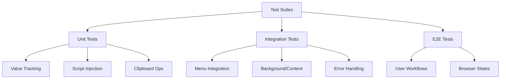

# Copy/Paste Functionality Migration - Test Documentation

## Test Coverage Overview

This document outlines the test coverage and verification strategy for the copy/paste functionality migration, ensuring reliability and proper integration with Manifest V3.

### Test Suites Structure



## Unit Tests

### Value Tracking Tests

```javascript
// chrome-menu-builder-spec.js
describe('MenuValueTracker', () => {
  beforeEach(() => {
    chrome.storage.local.clear();
  });

  it('should store selected menu value', async () => {
    const tracker = new MenuValueTracker();
    const value = 'test-value';
    
    await tracker.store(value);
    const stored = await tracker.retrieve();
    
    expect(stored).toBe(value);
  });

  it('should handle concurrent value updates', async () => {
    const tracker = new MenuValueTracker();
    const values = ['value1', 'value2'];
    
    await Promise.all(values.map(v => tracker.store(v)));
    const final = await tracker.retrieve();
    
    expect(final).toBe(values[1]);
  });
});
```

### Script Injection Tests

```javascript
// context-menu-spec.js
describe('ScriptInjector', () => {
  it('should inject content script successfully', async () => {
    const tabId = mockTab.id;
    const script = 'content-scripts/inject-value.mjs';
    
    const result = await ScriptInjector.inject(tabId, [script]);
    
    expect(result).toBeDefined();
    expect(chrome.scripting.executeScript).toHaveBeenCalledWith({
      target: { tabId },
      files: [script]
    });
  });

  it('should handle injection failures gracefully', async () => {
    const tabId = mockTab.id;
    chrome.scripting.executeScript.mockRejectedValue(new Error('Injection failed'));
    
    await expect(ScriptInjector.inject(tabId, ['nonexistent.js']))
      .rejects.toThrow('Injection failed');
  });
});
```

### Clipboard Operation Tests

```javascript
// clipboard-ops-spec.js
describe('ClipboardOperations', () => {
  const testText = 'Test content';

  it('should copy text to clipboard', async () => {
    const result = await handleCopy(testText);
    
    expect(result.success).toBe(true);
    expect(await navigator.clipboard.readText()).toBe(testText);
  });

  it('should paste text from clipboard', async () => {
    const element = document.createElement('input');
    await navigator.clipboard.writeText(testText);
    
    const result = await handlePaste(element);
    
    expect(result.success).toBe(true);
    expect(element.value).toBe(testText);
  });
});
```

## Integration Tests

### Menu Integration Tests

```javascript
// menu-integration-spec.js
describe('ContextMenuIntegration', () => {
  beforeEach(async () => {
    await chrome.contextMenus.removeAll();
  });

  it('should create menu structure from config', async () => {
    const config = await loadTestConfig();
    await initializeContextMenu(config);
    
    const items = await chrome.contextMenus.getAll();
    expect(items).toMatchSnapshot();
  });

  it('should handle menu clicks correctly', async () => {
    const handler = jest.fn();
    chrome.contextMenus.onClicked.addListener(handler);
    
    await simulateMenuClick('copyMenuItem');
    
    expect(handler).toHaveBeenCalled();
    expect(handler.mock.calls[0][0].menuItemId).toBe('copyMenuItem');
  });
});
```

### Background/Content Script Communication Tests

```javascript
// communication-spec.js
describe('BackgroundContentCommunication', () => {
  it('should relay messages between scripts', async () => {
    const message = { type: 'COPY_REQUEST', payload: 'test' };
    const response = await chrome.runtime.sendMessage(message);
    
    expect(response.success).toBe(true);
    expect(messageHandler).toHaveBeenCalledWith(message);
  });

  it('should handle connection errors', async () => {
    chrome.runtime.connect.mockImplementation(() => {
      throw new Error('Connection failed');
    });
    
    await expect(establishConnection())
      .rejects.toThrow('Connection failed');
  });
});
```

### Error Handling Tests

```javascript
// error-handling-spec.js
describe('ErrorHandling', () => {
  it('should recover from script injection failures', async () => {
    const errorSpy = jest.spyOn(console, 'error');
    chrome.scripting.executeScript.mockRejectedValueOnce(new Error('Injection failed'));
    
    await handlePasteOperation(mockTab.id);
    
    expect(errorSpy).toHaveBeenCalled();
    expect(await getLastError()).toBeDefined();
  });

  it('should retry failed operations', async () => {
    const operation = jest.fn()
      .mockRejectedValueOnce(new Error('First attempt failed'))
      .mockResolvedValueOnce('success');
    
    const result = await withRetry(operation);
    
    expect(result).toBe('success');
    expect(operation).toHaveBeenCalledTimes(2);
  });
});
```

## End-to-End Tests

### User Workflow Tests

```javascript
// workflow-spec.js
describe('UserWorkflows', () => {
  it('should complete copy-paste workflow', async () => {
    // Setup test page
    const page = await browser.newPage();
    await page.goto(testPageUrl);
    
    // Select text
    await page.click('#source');
    await page.keyboard.down('Control');
    await page.keyboard.press('a');
    await page.keyboard.up('Control');
    
    // Trigger copy via context menu
    await page.click('#source', { button: 'right' });
    await page.click('#copyMenuItem');
    
    // Verify clipboard content
    const clipboardText = await page.evaluate(() => 
      navigator.clipboard.readText()
    );
    expect(clipboardText).toBe('Expected text');
    
    // Paste into target
    await page.click('#target');
    await page.click('#target', { button: 'right' });
    await page.click('#pasteMenuItem');
    
    // Verify result
    const targetText = await page.evaluate(() => 
      document.querySelector('#target').value
    );
    expect(targetText).toBe('Expected text');
  });
});
```

### Browser State Tests

```javascript
// browser-state-spec.js
describe('BrowserStates', () => {
  it('should persist menu state across browser restarts', async () => {
    // Store initial state
    await storeMenuState({ selected: 'copyMenuItem' });
    
    // Simulate browser restart
    await browser.restart();
    
    // Verify state restored
    const state = await getMenuState();
    expect(state.selected).toBe('copyMenuItem');
  });

  it('should handle permission changes', async () => {
    // Simulate permission removal
    await browser.setPermissions({ permissions: [] });
    
    // Verify graceful degradation
    const menuItems = await chrome.contextMenus.getAll();
    expect(menuItems).toHaveLength(0);
    
    // Verify error handling
    const error = await getLastError();
    expect(error).toMatch(/permissions/i);
  });
});
```

## Test Coverage Requirements

1. Value Tracking:
   - Menu selection persistence
   - Concurrent updates handling
   - State recovery mechanisms

2. Script Injection:
   - Success scenarios
   - Error handling
   - Resource cleanup

3. Clipboard Operations:
   - Copy functionality
   - Paste functionality
   - Permission handling
   - Error recovery

4. Integration Points:
   - Menu creation/updates
   - Message passing
   - State synchronization
   - Error propagation

## Test Environment Setup

```javascript
// test/setup.js
global.chrome = {
  contextMenus: {
    create: jest.fn(),
    remove: jest.fn(),
    removeAll: jest.fn(),
    onClicked: {
      addListener: jest.fn()
    }
  },
  scripting: {
    executeScript: jest.fn()
  },
  runtime: {
    sendMessage: jest.fn(),
    onMessage: {
      addListener: jest.fn()
    }
  },
  storage: {
    local: {
      get: jest.fn(),
      set: jest.fn(),
      clear: jest.fn()
    }
  }
};

// Mock clipboard API
Object.defineProperty(navigator, 'clipboard', {
  value: {
    writeText: jest.fn(),
    readText: jest.fn()
  }
});
```

## Running Tests

```bash
# Run all tests
npm test

# Run specific test suite
npm test -- --testPathPattern=clipboard-ops

# Run with coverage
npm test -- --coverage

# Run E2E tests
npm run test:e2e
```

## Coverage Requirements

Minimum coverage thresholds:
```json
{
  "coverageThreshold": {
    "global": {
      "branches": 80,
      "functions": 85,
      "lines": 90,
      "statements": 90
    }
  }
}
