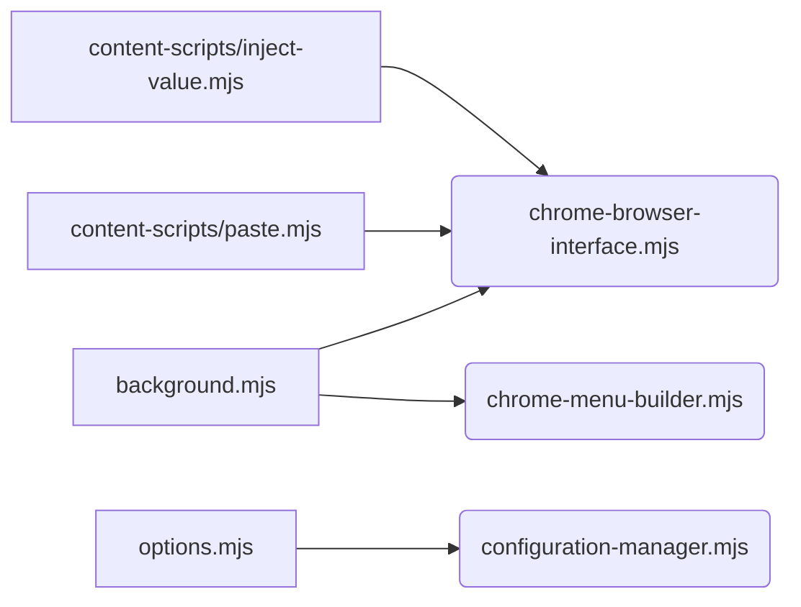
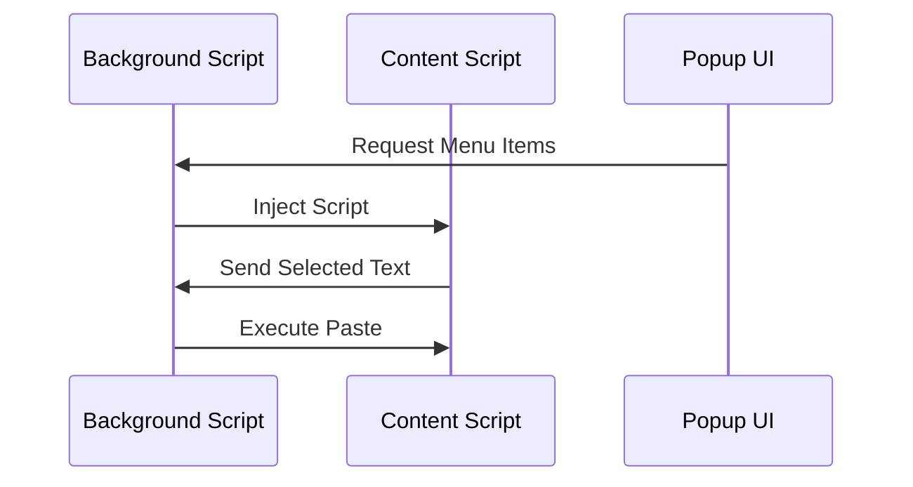

# Copy/Paste Functionality Migration Documentation

## Architecture Overview

### Module Structure and Dependencies

The copy/paste functionality is built on a modular architecture that separates concerns between background processing, user interface, and content manipulation.



#### Core Modules

- [`background.mjs`](template/background.mjs): Service worker that manages context menus and coordinates messaging
- [`chrome-browser-interface.mjs`](src/lib/chrome-browser-interface.mjs): Browser API abstraction layer
- [`chrome-menu-builder.mjs`](src/lib/chrome-menu-builder.mjs): Context menu construction and management
- [`paste.mjs`](template/content-scripts/paste.mjs): Content script for paste operations
- [`inject-value.mjs`](template/content-scripts/inject-value.mjs): Content script for value injection

### Event Flow and Message Passing

The extension uses an event-driven architecture with asynchronous message passing between components.



#### Key Message Flows

1. Copy Operation:
   ```javascript
   // Content script initiates copy
   chrome.runtime.sendMessage({
     type: 'COPY_REQUEST',
     payload: selectedText
   });
   
   // Background script handles copy
   chrome.runtime.onMessage.addListener(async (message, sender) => {
     if (message.type === 'COPY_REQUEST') {
       await chrome.scripting.executeScript({
         target: { tabId: sender.tab.id },
         func: copyToClipboard,
         args: [message.payload]
       });
     }
   });
   ```

2. Paste Operation:
   ```javascript
   // Background script initiates paste
   chrome.scripting.executeScript({
     target: { tabId: activeTab.id },
     files: ['content-scripts/paste.mjs']
   });
   
   // Content script executes paste
   document.activeElement.value = await navigator.clipboard.readText();
   ```

### Permission Model

Required permissions in manifest.json:
```json
{
  "permissions": [
    "contextMenus",
    "scripting",
    "clipboardRead",
    "clipboardWrite"
  ],
  "host_permissions": ["<all_urls>"]
}
```

#### Security Considerations

1. Clipboard Access
   - Only access clipboard in response to explicit user actions
   - Sanitize clipboard content before injection
   - Use try-catch blocks for clipboard operations

2. Script Injection
   - Validate target elements before injection
   - Use CSP headers to restrict script execution
   - Implement content validation checks

### Error Handling Strategy

Comprehensive error handling implemented at multiple levels:

```javascript
// Global error handler in background script
window.addEventListener('unhandledrejection', (event) => {
  console.error('Unhandled promise rejection:', event.reason);
  notifyUser('Operation failed. Please try again.');
});

// Feature-specific error handling
async function handlePasteOperation(tabId) {
  try {
    await chrome.scripting.executeScript({
      target: { tabId },
      files: ['content-scripts/paste.mjs']
    });
  } catch (error) {
    console.error('Paste operation failed:', error);
    handlePasteError(error);
  }
}
```

## Migration Changes

### CommonJS to ES Modules Conversion

1. Import/Export Syntax:
   ```javascript
   // Old CommonJS syntax
   const { copyToClipboard } = require('./clipboard-utils');
   
   // New ES Module syntax
   import { copyToClipboard } from './clipboard-utils.mjs';
   ```

2. Dynamic Imports:
   ```javascript
   // Handle dynamic module loading
   const handler = await import('./handlers/paste-handler.mjs');
   ```

### Manifest V3 Adaptation

1. Service Worker Registration:
   ```json
   {
     "manifest_version": 3,
     "background": {
       "service_worker": "background.mjs",
       "type": "module"
     }
   }
   ```

2. API Updates:
   ```javascript
   // Old: chrome.tabs.executeScript
   chrome.tabs.executeScript(tabId, { code: 'document.body.style.backgroundColor = "red"' });
   
   // New: chrome.scripting.executeScript
   chrome.scripting.executeScript({
     target: { tabId },
     func: () => { document.body.style.backgroundColor = "red" }
   });
   ```

## Implementation Details

### Menu Value Tracking

The context menu system maintains state using chrome.storage.local:

```javascript
// Store menu selection
await chrome.storage.local.set({
  selectedValue: info.menuItemId,
  contextData: {
    timestamp: Date.now(),
    context: info.contexts
  }
});

// Retrieve menu selection
const { selectedValue } = await chrome.storage.local.get('selectedValue');
```

### Script Injection Mechanism

Modular script injection system:

```javascript
class ScriptInjector {
  static async inject(tabId, scripts) {
    const results = await chrome.scripting.executeScript({
      target: { tabId },
      files: scripts
    });
    return results[0]?.result;
  }
  
  static async executeFunction(tabId, func, ...args) {
    return chrome.scripting.executeScript({
      target: { tabId },
      func,
      args
    });
  }
}
```

### Clipboard Operation Flow

1. Copy Operation:
   ```javascript
   export async function handleCopy(text) {
     try {
       await navigator.clipboard.writeText(text);
       return { success: true };
     } catch (error) {
       console.error('Copy failed:', error);
       return { success: false, error };
     }
   }
   ```

2. Paste Operation:
   ```javascript
   export async function handlePaste(element) {
     try {
       const text = await navigator.clipboard.readText();
       element.value = text;
       element.dispatchEvent(new Event('input', { bubbles: true }));
       return { success: true };
     } catch (error) {
       console.error('Paste failed:', error);
       return { success: false, error };
     }
   }
   ```

## Security and Permissions

### Required Permissions

1. Manifest Permissions:
   - `contextMenus`: Context menu creation and management
   - `scripting`: Content script injection
   - `clipboardRead`: Paste operations
   - `clipboardWrite`: Copy operations
   - Host permissions: Required for script injection

2. Optional Permissions:
   - `storage`: State management
   - `activeTab`: Current tab access

### Security Model

1. Content Security Policy:
   ```json
   {
     "content_security_policy": {
       "extension_pages": "script-src 'self'; object-src 'self'"
     }
   }
   ```

2. Input Sanitization:
   ```javascript
   function sanitizeInput(input) {
     return input.replace(/[<>]/g, '');
   }
   ```

### Error Recovery

1. Automatic Retry Logic:
   ```javascript
   async function withRetry(operation, maxAttempts = 3) {
     for (let attempt = 1; attempt <= maxAttempts; attempt++) {
       try {
         return await operation();
       } catch (error) {
         if (attempt === maxAttempts) throw error;
         await new Promise(resolve => setTimeout(resolve, 1000 * attempt));
       }
     }
   }
   ```

2. State Recovery:
   ```javascript
   async function recoverState() {
     const state = await chrome.storage.local.get('lastKnownGood');
     if (state.lastKnownGood) {
       return state.lastKnownGood;
     }
     return initializeDefaultState();
   }
   ```

## Testing Considerations

1. Unit Tests:
   ```javascript
   describe('Clipboard Operations', () => {
     it('should handle copy operation', async () => {
       const text = 'Test content';
       const result = await handleCopy(text);
       expect(result.success).toBe(true);
     });
   });
   ```

2. Integration Tests:
   ```javascript
   describe('Context Menu Integration', () => {
     it('should create menu items', async () => {
       await initializeContextMenu();
       const items = await chrome.contextMenus.getAll();
       expect(items.length).toBeGreaterThan(0);
     });
   });
   ```

## Development Workflow

1. Local Development:
   ```bash
   npm run dev  # Starts development mode
   npm run test # Runs test suite
   npm run lint # Checks code style
   ```

2. Debugging:
   - Use Chrome DevTools for service worker inspection
   - Monitor console for error messages
   - Use Storage API Explorer for state debugging
