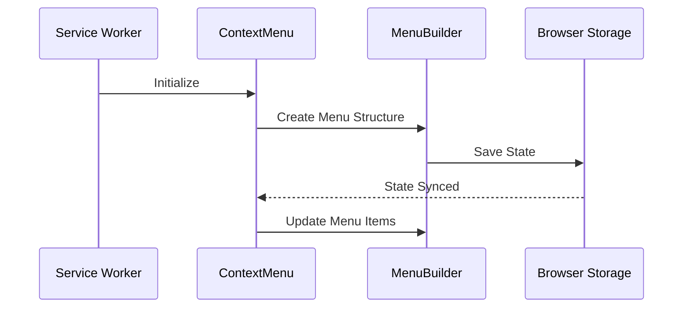
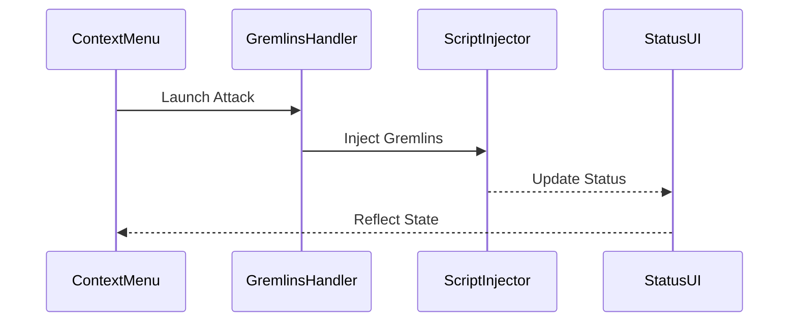

# Current Architectural Assessment

## Overview

This document provides an architectural assessment of the TestudoQ extension, focusing on the completed ES module migration, right-click functionality, and gremlins integration. The assessment covers key components including service workers, ES modules, state management, and browser integration.

## Key Files

- [`src/main/background.mjs`](src/main/background.mjs) - Service worker entry point
- [`src/lib/context-menu.mjs`](src/lib/context-menu.mjs) - Menu management
- [`src/lib/chrome-menu-builder.mjs`](src/lib/chrome-menu-builder.mjs) - Chrome menu implementation
- [`src/lib/firefox-menu-builder.mjs`](src/lib/firefox-menu-builder.mjs) - Firefox menu implementation
- [`src/lib/process-menu-object.mjs`](src/lib/process-menu-object.mjs) - Menu configuration processor
- [`template/manifest.json`](template/manifest.json) - Extension manifest

## Current Architecture

### 1. ES Module Implementation

- ✅ All JavaScript files converted to ES modules (.mjs)
- ✅ Import/export statements standardized
- ✅ Build process updated for module support
- ✅ Module resolution paths fixed
- ✅ Browser compatibility verified

### 2. Service Worker Architecture

- Service worker properly registered with `type: module`
- Top-level context menu registration
- Efficient state management
- Proper error handling and recovery
- Clean browser API integration

### 3. Menu System

- Hierarchical menu structure
- Dynamic updates based on state
- Cross-browser compatibility
- Real-time status indicators
- Clean separation of concerns

### 4. State Management

- Centralized state handling
- Storage synchronization
- Event-based updates
- Clean state transitions
- Proper cleanup on unload

### 5. Browser Integration

- Chrome/Firefox abstraction layer
- Standardized API access
- Proper permission handling
- Efficient script injection
- Cross-browser testing support

## Core Functionality

### 1. Menu Management

### 2. Gremlins Integration

## Improvements Made

1. **Module System**
   - Converted all files to ES modules
   - Standardized import/export syntax
   - Fixed module resolution paths
   - Updated build configuration

2. **State Management**
   - Implemented centralized state
   - Added storage synchronization
   - Improved error recovery
   - Enhanced status tracking

3. **Performance**
   - Optimized menu rebuilding
   - Improved script injection
   - Enhanced state updates
   - Reduced redundant operations

4. **Error Handling**
   - Added comprehensive error capture
   - Implemented recovery strategies
   - Enhanced user feedback
   - Improved debugging support

## Architecture Benefits

1. **Maintainability**
   - Clean module structure
   - Clear dependency graph
   - Consistent patterns
   - Well-documented interfaces

2. **Reliability**
   - Robust error handling
   - State recovery mechanisms
   - Clean cleanup processes
   - Proper resource management

3. **Performance**
   - Efficient state updates
   - Optimized menu operations
   - Smart caching
   - Minimal redraws

4. **Extensibility**
   - Modular architecture
   - Clean interfaces
   - Plugin system ready
   - Easy feature addition

## Current Limitations

1. **Browser-Specific**
   - Some Firefox-specific features untested
   - Chrome-centric optimizations
   - Limited browser coverage

2. **Testing**
   - More unit tests needed
   - Limited E2E coverage
   - Performance testing gaps
   - Cross-browser scenarios

## Next Steps

1. **Testing Improvements**
   - Add comprehensive unit tests
   - Implement E2E testing
   - Add performance benchmarks
   - Expand browser coverage

2. **Documentation**
   - Update API documentation
   - Add architectural diagrams
   - Document best practices
   - Create migration guide

3. **Performance**
   - Profile key operations
   - Optimize state updates
   - Reduce bundle size
   - Improve startup time

4. **Features**
   - Expand browser support
   - Add configuration UI
   - Enhance debugging tools
   - Implement analytics
