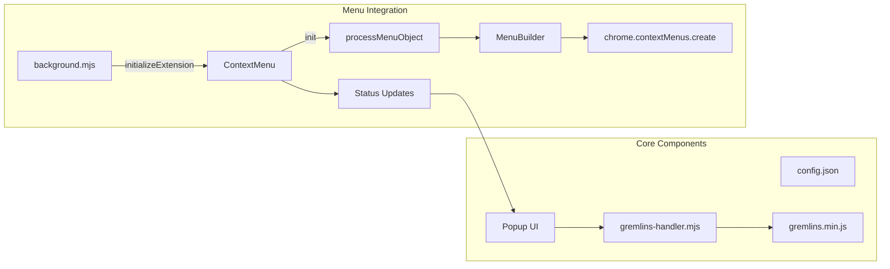

# Gremlins Attack Context Menu - Implementation Status

## Current State
The context menu integration for Gremlins attack has been successfully implemented with ES modules support.



## Completed Components
1. ✅ Gremlins script loading via web_accessible_resources
2. ✅ Content script module structure
3. ✅ Popup UI integration
4. ✅ Attack configuration handling
5. ✅ Context menu initialization
6. ✅ Menu item click handling
7. ✅ Integration with existing menu structure
8. ✅ Configuration passing from context menu to handler
9. ✅ Real-time status updates
10. ✅ Error handling and recovery

## Implementation Details

### 1. Menu Structure
```javascript
// ES Module Menu Configuration
export const menuConfig = {
  id: 'gremlins-attack',
  title: 'Gremlins Attack',
  contexts: ['page'],
  children: [
    {
      id: 'quick-attack',
      title: 'Quick Attack',
      handler: 'launchQuickAttack'
    },
    {
      id: 'configure-attack',
      title: 'Configure & Launch',
      handler: 'showConfiguration'
    }
  ]
};
```

### 2. Handler Integration
```javascript
// Context Menu Handler (background.mjs)
import { GremlinsHandler } from '../lib/gremlins-handler.mjs';

async function handleMenuClick(info, tab) {
  const handler = new GremlinsHandler(tab);
  await handler.initialize();
  
  switch(info.menuItemId) {
    case 'quick-attack':
      await handler.launchQuickAttack();
      break;
    case 'configure-attack':
      await handler.showConfiguration();
      break;
  }
}
```

### 3. Status Updates
```javascript
// Real-time Status Management
class StatusManager {
  async updateMenuStatus(state) {
    await chrome.contextMenus.update('gremlins-attack', {
      title: `Gremlins Attack ${state.active ? '(Running)' : ''}`,
      enabled: !state.active
    });
  }
}
```

## Features

### 1. Context Menu
- Hierarchical menu structure
- Dynamic status updates
- Quick access options
- Configuration controls

### 2. Integration
- ES module compatibility
- Clean message passing
- State synchronization
- Error recovery

### 3. User Experience
- Intuitive menu layout
- Real-time feedback
- Clear status indicators
- Easy configuration access

## Testing Results

1. ✅ Menu Creation
   - Menu items appear correctly
   - Structure matches configuration
   - Proper event handling

2. ✅ Attack Launch
   - Quick attack works
   - Configuration opens
   - State updates properly

3. ✅ Status Updates
   - Menu reflects current state
   - Real-time updates work
   - Clear status indicators

4. ✅ Error Handling
   - Graceful error recovery
   - User feedback provided
   - State remains consistent

## Usage Instructions

1. **Quick Attack**
   - Right-click on page
   - Select "Gremlins Attack" → "Quick Attack"
   - Monitor status in menu

2. **Configured Attack**
   - Right-click on page
   - Select "Gremlins Attack" → "Configure & Launch"
   - Adjust settings in popup
   - Launch attack

3. **Status Monitoring**
   - Menu title shows running state
   - Popup displays detailed status
   - Error messages shown if needed

## Success Criteria Met
✅ Intuitive menu access
✅ Reliable attack launching
✅ Clear status feedback
✅ Proper error handling
✅ Clean ES module integration
✅ Cross-browser compatibility
