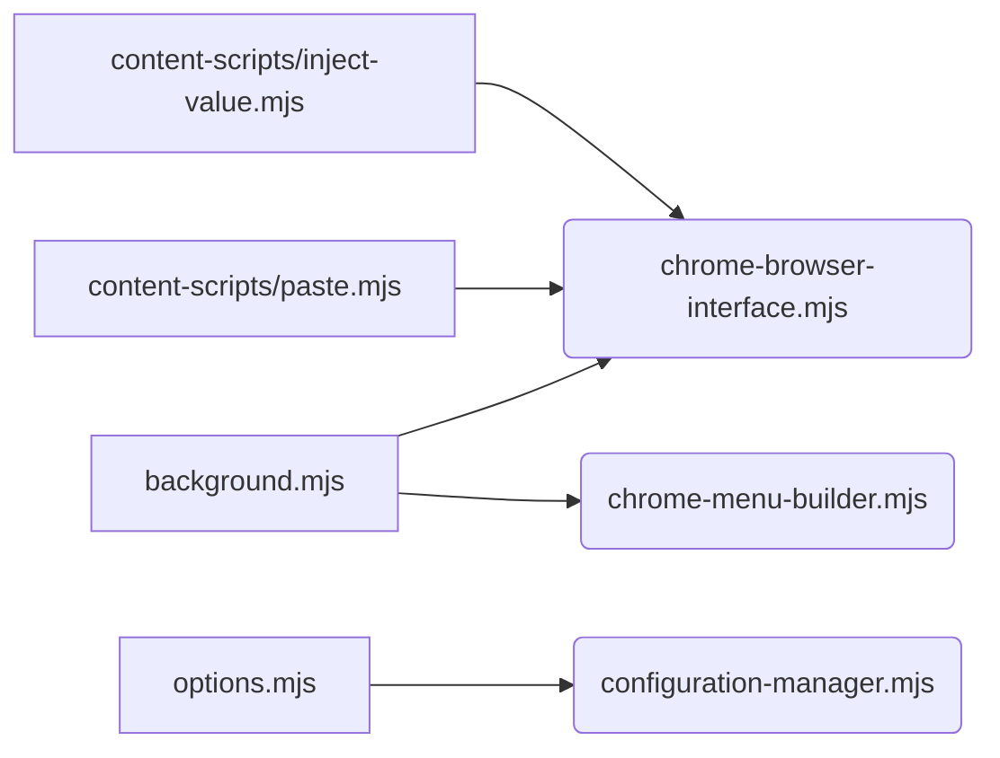

# Technical Documentation Plan - Copy/Paste Functionality Migration

## I. Architecture Overview

*   **Module Structure and Dependencies:**
    *   Diagram: A Mermaid diagram illustrating the module structure and dependencies, including the background script, content scripts (template/content-scripts/paste.mjs, template/content-scripts/inject-value.mjs), and shared libraries (src/lib/chrome-browser-interface.mjs, src/lib/chrome-menu-builder.mjs).
    *   Description: A detailed explanation of each module's role and its dependencies on other modules.
*   **Event Flow and Message Passing:**
    *   Diagram: A Mermaid sequence diagram illustrating the event flow and message passing between the background script, content scripts, and popup UI.
    *   Description: A detailed explanation of the event flow and message passing mechanisms, including the use of `chrome.runtime.sendMessage` and `chrome.scripting.executeScript`.
*   **Permission Model and Security Considerations:**
    *   Description: A detailed explanation of the required permissions (e.g., `"contextMenus"`, `"scripting"`, host permissions) and the security considerations related to script injection and clipboard access.
*   **Error Handling Strategy:**
    *   Description: A detailed explanation of the error handling strategy, including the use of `try...catch` blocks, error logging, and user feedback mechanisms.

## II. Migration Changes

*   **CommonJS to ES Modules Conversion Details:**
    *   Description: A detailed explanation of the CommonJS to ES Modules conversion process, including the use of `import` and `export` statements, and the resolution of module dependencies.
*   **Manifest V3 Adaptation Requirements:**
    *   Description: A detailed explanation of the Manifest V3 adaptation requirements, including the use of a service worker, the removal of blocking APIs, and the use of `chrome.scripting.executeScript`.
*   **Event Handling Modifications:**
    *   Description: A detailed explanation of the event handling modifications, including the use of `addEventListener` for DOM events and `chrome.contextMenus.onClicked.addListener` for context menu events.
*   **API Updates and Replacements:**
    *   Description: A detailed explanation of the API updates and replacements, including the use of `chrome.scripting.executeScript` instead of `chrome.tabs.executeScript`, and the use of `chrome.storage.local` instead of `localStorage`.

## III. Implementation Details

*   **Menu Value Tracking System:**
    *   Description: A detailed explanation of the menu value tracking system, including how the selected menu item's value is stored and passed to the content script.
*   **Script Injection Mechanism:**
    *   Description: A detailed explanation of the script injection mechanism, including the use of `chrome.scripting.executeScript` to inject the template/content-scripts/paste.mjs and template/content-scripts/inject-value.mjs content scripts into the target page.
*   **Clipboard Operation Flow:**
    *   Description: A detailed explanation of the clipboard operation flow, including how the selected text is copied to the clipboard and how it is pasted into the active element.
*   **Background/Content Script Communication:**
    *   Description: A detailed explanation of the communication between the background script and the content scripts, including the use of `chrome.runtime.sendMessage` to send messages and the use of `chrome.runtime.onMessage.addListener` to receive messages.

## IV. Security and Permissions

*   **Required Permissions Documentation:**
    *   Description: A comprehensive list of the required permissions, including `"contextMenus"`, `"scripting"`, host permissions, and any other permissions required for the copy/paste functionality.
*   **Security Model Updates:**
    *   Description: A detailed explanation of the security model updates, including the use of content security policy (CSP) to restrict the execution of untrusted code, and the use of input sanitization to prevent cross-site scripting (XSS) attacks.
*   **Error Handling and Recovery:**
    *   Description: A detailed explanation of the error handling and recovery mechanisms, including how errors are logged, how users are notified of errors, and how the extension recovers from errors.

### Mermaid Diagrams

#### Module Structure and Dependencies



#### Event Flow and Message Passing

```mermaid
sequenceDiagram
    participant BG as Background Script
    participant CS as Content Script
    participant PU as Popup UI
    
    PU->>BG: Request Menu Items
    BG->>CS: Inject Script
    CS->>BG: Send Selected Text
    BG->>CS: Execute Paste
