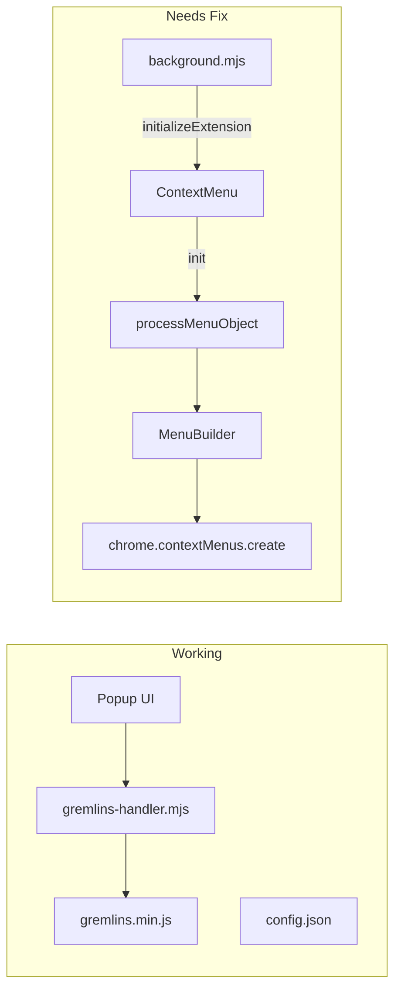

# Fix Gremlins Attack Context Menu - Status Update

## Current State
The popup UI for Gremlins attack is now working, but the context menu integration still needs to be fixed.

## Fixed Components
1. ✅ Gremlins script loading via web_accessible_resources
2. ✅ Content script module structure
3. ✅ Popup UI integration
4. ✅ Attack configuration handling

## Pending Fixes
1. ❌ Context menu initialization
2. ❌ Menu item click handling
3. ❌ Integration with existing menu structure
4. ❌ Configuration passing from context menu to handler

## Next Steps
1. Review context menu initialization in background.mjs
2. Fix menu item creation and click handling
3. Ensure proper message passing between context menu and content scripts
4. Add proper error handling for context menu interactions

## Testing Plan
When fixed, the context menu should:
1. Show gremlins attack option on right-click
2. Use configuration from config.json
3. Successfully trigger attack through gremlins-handler.mjs
4. Provide feedback on attack status

Note: Currently, users should use the popup UI for gremlins functionality while context menu integration is being fixed.
