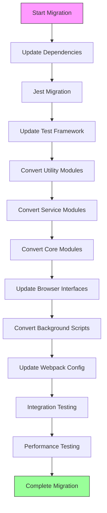

# CommonJS to ES Modules Migration Plan

## 1. Introduction

### Goals
- Migrate existing CommonJS modules to ES modules (ESM) for Manifest V3 compatibility
- Modernize codebase to leverage ES6+ features
- Improve code maintainability and module resolution
- Enable better tree-shaking and bundle optimization

### Necessity
- Manifest V3 requires ES modules for service workers
- Better alignment with modern JavaScript ecosystem
- Enhanced developer experience with native async/await support
- Improved bundle size through better dead code elimination

### Expected Outcomes
- Full ESM compatibility across the codebase
- Reduced bundle size through better tree-shaking
- Improved development experience with modern syntax
- Better testing infrastructure with Jest ESM support

## 2. General Recommendations & Preparation

### Version Control
- Create a dedicated `esm-migration` branch
- Use atomic commits with clear messages
- Tag significant migration milestones
- Maintain detailed changelog in `memory-bank/migration-status.md`

### Prerequisites
- Node.js version: >=18.0.0 (Latest LTS)
- Update package.json:
  ```json
  {
    "type": "module",
    "engines": {
      "node": ">=18.0.0"
    }
  }
  ```

### File Extension Convention
- **Approach**: All JavaScript files will be renamed from `.js` to `.mjs`
- **Rationale**:
  - Explicit file extensions provide better clarity about module type
  - Avoids reliance on package.json "type" field
  - Ensures consistent behavior across different environments
  - Simplifies mixed-mode scenarios during transition
- **Implementation**:
  ```javascript
  // Old: my-module.js
  const { helper } = require('./helper');
  
  // New: my-module.mjs
  import { helper } from './helper.mjs';
  ```
- **Exception**: Test files will maintain `.js` extension for Jest compatibility

### Timeline Estimation
- Phase 1 (Jest Migration): 1-2 weeks
- Phase 2 (Module Conversion): 2-3 weeks
- Total: 3-5 weeks depending on complexity

#### Timeline Adjustment Factors
- **Codebase Size**: Add 1 week per 50k lines of code
- **Dependencies**: Add 2-3 days per major ESM-incompatible dependency
- **Integration Complexity**: Add 1-2 weeks if extensive browser API integration exists
- **Team Familiarity**: Reduce by 20% if team has prior ESM migration experience

#### Project-Specific Considerations
- Browser API integration complexity
- Third-party library ESM compatibility
- Test coverage adequacy
- Deployment pipeline modifications
- Browser compatibility requirements

### Dependency Updates
1. Update test framework dependencies:
   ```bash
   npm install --save-dev jest@latest @babel/core@latest @babel/preset-env@latest
   ```
2. Update build tools:
   ```bash
   npm install --save-dev webpack@latest webpack-cli@latest
   ```

### Mixed Mode Support
#### Interoperability Strategy
1. **Dynamic Imports in CommonJS**:
   ```javascript
   // In CJS modules during transition
   async function loadESModule() {
     const { default: myESM } = await import('./esm-module.mjs');
     return myESM;
   }
   ```

2. **Conditional Exports**:
   ```json
   {
     "name": "my-package",
     "exports": {
       ".": {
         "import": "./index.mjs",
         "require": "./index.cjs"
       }
     }
   }
   ```

3. **Wrapper Modules**:
   ```javascript
   // wrapper.cjs
   module.exports = async () => {
     const { feature } = await import('./modern-feature.mjs');
     return feature;
   };
   ```

#### Temporary Compatibility Layer
- Create bridge modules for critical paths
- Use async boundaries for ESM/CJS interfaces
- Implement feature detection for module support

### Rollback Strategy
1. Maintain feature branch isolation
2. Create restoration points before major changes
3. Document all configuration changes
4. Keep CommonJS versions until full testing completion

## 3. Phase 1: Jest Migration

### Initial Setup
1. Create new Jest configuration file (jest.config.js):
   ```javascript
   export default {
     transform: {
       '^.+\\.jsx?$': 'babel-jest'
     },
     testEnvironment: 'jsdom',
     moduleFileExtensions: ['js', 'mjs'],
     testMatch: ['**/*.spec.js'],
     transformIgnorePatterns: [
       '/node_modules/(?!@org\\/pkg1|@org\\/pkg2).+\\.js$',
       '/node_modules/(?!lodash-es).+\\.mjs$'
     ]
   };
   ```

#### ESM Dependencies Handling
1. **Identifying ESM Dependencies**:
   ```javascript
   // In jest.config.js
   export default {
     moduleNameMapper: {
       '^lodash-es$': 'lodash',
       '^vue$': 'vue/dist/vue.common.js'
     }
   };
   ```

2. **Common Adjustment Patterns**:
   ```javascript
   // Package-specific transforms
   {
     transform: {
       '^.+\\.m?js$': ['babel-jest', {
         presets: [
           ['@babel/preset-env', {
             targets: { node: 'current' },
             modules: 'auto'
           }]
         ]
       }]
     }
   }
   ```

2. Update Babel configuration (.babelrc):
   ```json
   {
     "presets": [
       ["@babel/preset-env", {
         "targets": {
           "node": "current"
         }
       }]
     ]
   }
   ```

### Test Framework Migration
1. Convert test helpers to ES modules
2. Update import statements in test files
3. Migrate mock implementations
4. Update test running scripts in package.json

## 4. Phase 2: ES6 Module Conversion

### Module Conversion Order (Leaf-First Strategy)
1. Utility modules (src/lib/logger.js, src/lib/trigger-events.js)
2. Service modules (src/lib/*-request-handler.js)
3. Core functionality (src/lib/configuration-manager.js)
4. Browser interfaces (src/lib/*-browser-interface.js)
5. Background and service workers (src/main/background.js)

### Background.js and Service Workers
- Convert to ES modules explicitly
- Update service worker registration
- Handle import scoping
- Example conversion:
  ```javascript
  // Before (CommonJS):
  const { handleRequest } = require('./lib/request-handler');
  
  // After (ES Modules):
  import { handleRequest } from './lib/request-handler.mjs';
  ```

### CommonJS Variable Handling
- Replace __dirname and __filename:
  ```javascript
  import { fileURLToPath } from 'url';
  import { dirname } from 'path';
  
  const __filename = fileURLToPath(import.meta.url);
  const __dirname = dirname(__filename);
  ```

### Automated Conversion Tools
1. Dependencies scanner:
   ```bash
   npx dependency-cruise src/ -T dot > dependencies.dot
   ```
2. ESM conversion helpers:
   - `jscodeshift` for automated transforms
   - `lebab` for ES6 syntax conversion

### Webpack Configuration
```javascript
export default {
  entry: './src/main/background.js',
  experiments: {
    outputModule: true
  },
  output: {
    filename: 'background.js',
    module: true,
    library: {
      type: 'module'
    }
  },
  resolve: {
    extensions: ['.js', '.mjs']
  }
};
```

## 5. Implementation Flow



### Parallel vs Sequential Tasks
1. Sequential:
   - Dependency updates
   - Jest migration
   - Core module conversion
   - Background script conversion

2. Parallel:
   - Utility module conversion
   - Service module conversion
   - Test updates
   - Documentation updates

### Testing Strategy
1. Unit Tests:
   - Convert to ES module syntax
   - Update import statements
   - Verify test coverage

2. Integration Tests:
   - End-to-end functionality
   - Browser compatibility
   - Service worker behavior

3. Performance Tests:
   - Bundle size comparison
   - Load time metrics
   - Memory usage analysis
