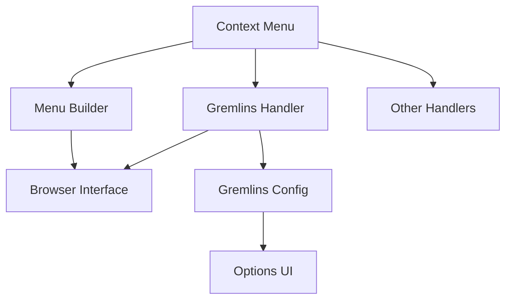

# System Patterns

## Architectural Patterns

### Handler Pattern
The system uses a handler-based architecture for managing different functionalities:
- Each feature has a dedicated handler module
- Handlers are registered with the context menu system
- Common interface for all handlers (browserInterface, tabId)

### Browser Interface Abstraction
- Chrome and Firefox specific implementations
- Common interface for cross-browser compatibility
- Handles browser-specific API differences

### Menu Builder Pattern
- Hierarchical menu construction
- Dynamic menu updates
- Handler registration system

## Component Relationships

## Design Patterns

### Factory Pattern
- Menu builder creation
- Handler instantiation
- Browser interface selection

### Observer Pattern
- Storage change listeners
- Menu update notifications
- Configuration changes

### Strategy Pattern
- Gremlins attack strategies
- Menu handling strategies
- Browser-specific implementations

## Data Flow Patterns

### Configuration Flow
1. User Input (UI) → Configuration Object
2. Configuration Storage → Handler Configuration
3. Handler Execution → Browser Actions

### Menu Action Flow
1. Context Menu Selection → Handler Identification
2. Handler Execution → Browser Interface
3. Browser Interface → Content Script Injection

## Extension Architecture

### Components
1. Background Script
   - Menu management
   - Handler coordination
   - Browser interface

2. Content Scripts
   - Gremlins injection
   - DOM interaction
   - Event handling

3. Options UI
   - Configuration management
   - User interface
   - Settings persistence

### Communication Patterns
- Message passing between components
- Event-based communication
- Storage-based synchronization
