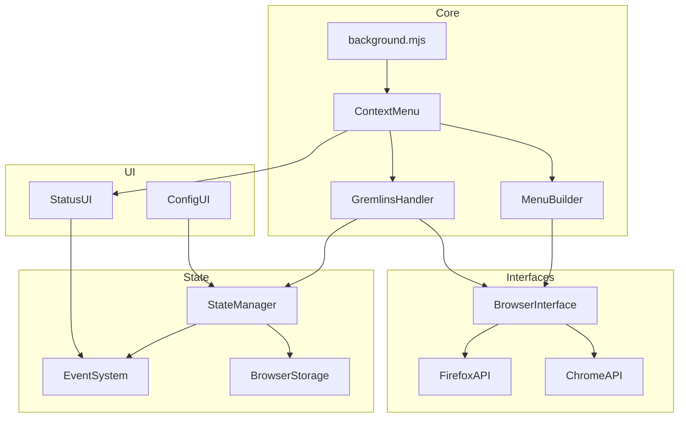

# System Patterns

## ES Module Architecture

### Module Organization
```plaintext
src/
  ├── main/          # Core ES modules
  │   ├── background.mjs
  │   └── options.mjs
  ├── lib/           # Shared modules
  │   ├── context-menu.mjs
  │   └── gremlins-handler.mjs
  └── content-scripts/ # Content script modules
      └── gremlins-handler.mjs
```

### Module Patterns
```javascript
// Export pattern for services
export class GremlinsHandler {
  async initialize() { /* ... */ }
  async launchAttack() { /* ... */ }
}

// Import pattern for dependencies
import { BrowserInterface } from '../lib/browser-interface.mjs';
import { ConfigManager } from '../lib/config-manager.mjs';
```

## Architectural Patterns

### Handler Pattern
```javascript
// Handler base interface
export class BaseHandler {
  constructor(browserInterface) {
    this.browser = browserInterface;
  }
  
  async initialize() { /* ... */ }
  async execute() { /* ... */ }
}

// Concrete handler implementation
export class GremlinsHandler extends BaseHandler {
  async execute(config) {
    await this.injectGremlins(config);
    await this.startAttack();
  }
}
```

### Browser Interface Abstraction
```javascript
// Browser-agnostic interface
export class BrowserInterface {
  async executeScript(tabId, code) { /* ... */ }
  async sendMessage(tabId, message) { /* ... */ }
}

// Browser-specific implementations
export class ChromeInterface extends BrowserInterface {
  async executeScript(tabId, code) {
    return chrome.scripting.executeScript({ /* ... */ });
  }
}
```

### Menu Builder Pattern
```javascript
// Menu construction
export class MenuBuilder {
  async buildMenu(config) {
    await this.removeExisting();
    await this.createStructure(config);
    await this.wireHandlers();
  }
}
```

## Component Relationships



## Design Patterns

### Factory Pattern
```javascript
// Browser interface factory
export class BrowserInterfaceFactory {
  static create() {
    return isChrome() 
      ? new ChromeInterface()
      : new FirefoxInterface();
  }
}
```

### Observer Pattern
```javascript
// State change notification
export class StateManager {
  notify(change) {
    this.observers.forEach(observer => 
      observer.onStateChange(change)
    );
  }
}
```

### Strategy Pattern
```javascript
// Attack strategies
export class GremlinsStrategy {
  static get strategies() {
    return {
      CHAOS: 'random',
      FOCUSED: 'targeted',
      SMART: 'intelligent'
    };
  }
}
```

## Data Flow Patterns

### Message Flow
```javascript
// Content script communication
async function messageHandler(message, sender) {
  switch (message.type) {
    case 'START_ATTACK':
      return handleAttackStart(message.config);
    case 'UPDATE_STATUS':
      return updateStatusUI(message.status);
  }
}
```

### State Management
```javascript
// Centralized state
export class State {
  static async update(changes) {
    await storage.set(changes);
    notifyListeners(changes);
  }
}
```

## Extension Architecture

### Service Worker (background.mjs)
```javascript
// Top-level initialization
import { MenuSystem } from './menu-system.mjs';
import { StateManager } from './state-manager.mjs';

const menuSystem = new MenuSystem();
const stateManager = new StateManager();

await Promise.all([
  menuSystem.initialize(),
  stateManager.initialize()
]);
```

### Event System
```javascript
// Event handling
export class EventSystem {
  on(event, handler) {
    this.handlers.set(event, handler);
  }
  
  emit(event, data) {
    const handler = this.handlers.get(event);
    if (handler) handler(data);
  }
}
```

## Success Patterns

### Error Handling
```javascript
// Consistent error handling
try {
  await operation();
} catch (error) {
  console.error('[System]', error);
  notifyUser(error.message);
  await cleanup();
}
```

### Resource Management
```javascript
// Clean resource handling
class ResourceManager {
  async acquire() { /* ... */ }
  async release() { /* ... */ }
  
  async using(resource, operation) {
    try {
      await this.acquire(resource);
      return await operation(resource);
    } finally {
      await this.release(resource);
    }
  }
}
```

### Status Updates
```javascript
// Real-time status propagation
class StatusManager {
  updateStatus(status) {
    this.current = status;
    this.notifyUI();
    this.persistState();
  }
}
