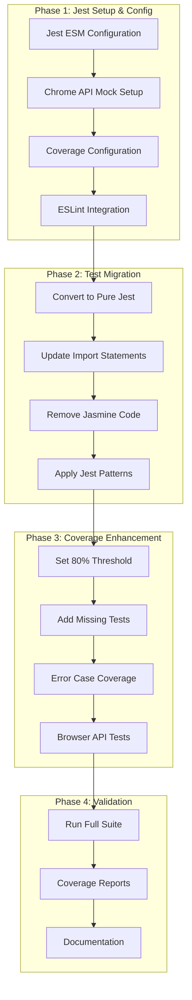

# Jest Implementation Plan

## Overview
This plan outlines the steps to implement Jest unit test coverage and compliance for the TestudoQ project, focusing on ES6 module support and proper test organization.

## Implementation Phases

## Detailed Steps

### Phase 1: Jest Setup & Configuration
1. ✅ Configuration Updates:
   - Jest config in ESM format
   - ESM test file support
   - jsdom test environment
   - Proper module mapping

2. Chrome API Mocking:
   - Implement core browser API mocks
   - Focus on extension-specific APIs
   - Mock storage and messaging

3. Coverage Setup:
   - Configure Istanbul coverage
   - Set 80% threshold for core modules
   - Track branch coverage

4. ESLint Integration:
   - Add Jest plugin
   - Configure test-specific rules
   - Enforce consistent patterns

### Phase 2: Test Migration
1. Remove Jasmine Dependencies:
   - Convert all assertion styles
   - Update test syntax
   - Remove Jasmine-specific code

2. Update Test Structure:
   - Consistent describe blocks
   - Jest-style setup/teardown
   - Modern ES6 syntax

3. Import/Export Updates:
   - Use ES module imports
   - Update mock implementations
   - Fix circular dependencies

### Phase 3: Coverage Enhancement
1. Core Module Coverage:
   - Target 80% coverage for all files
   - Focus on:
     - context-menu
     - gremlins-handler
     - chrome-menu-builder
     - browser interfaces

2. Error Handling:
   - API failure scenarios
   - Permission handling
   - Invalid states
   - Edge cases

3. Browser API Testing:
   - Chrome API method coverage
   - Storage operations
   - Message passing
   - Permission states

### Phase 4: Validation & Documentation
1. Test Execution:
   - Full suite runs
   - Coverage validation
   - Performance checks

2. Documentation:
   - Test patterns
   - Mock usage
   - Setup requirements
   - Common pitfalls

## Success Criteria
1. All tests running in Jest ES6 format
2. 50% or higher coverage on core modules
3. No Jasmine code remaining
4. Consistent test patterns across codebase
5. Complete browser API mocking
6. Comprehensive error case coverage

## Technical Notes
- Use `.test.mjs` extension for all test files
- Maintain folder structure under `test/unit/`
- Ensure proper isolation between tests
- Focus on unit test coverage, not E2E scenarios

## Next Steps
1. Begin with Phase 1 setup completion
2. Migrate one test file as a prototype
3. Review and adjust patterns
4. Scale to remaining test files
